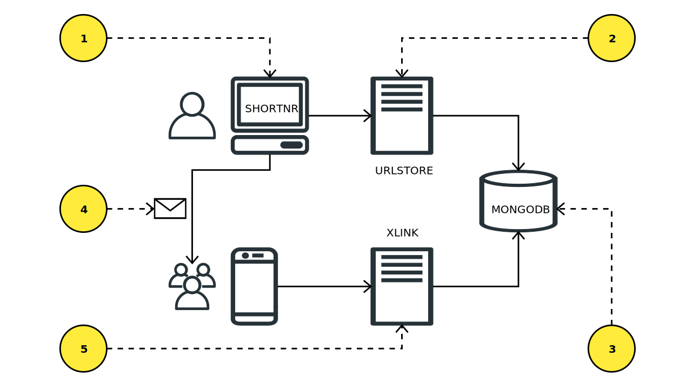

# Url shortener

Web browsers can open URLs containing up to 2000 characters,
but sending such long link can be sometimes problematic,-
some applications have limmits on maximum message length.
And short URLs simply look more aesthetically pleasing🌼

The URL shortening service provides short links redirecting
to long target urls, so that a relatively short link can be
passed around until it is actually opened.

The software in this repository includes both:

- a short link creation web application,
  where users can create short links for their long URLs;
- a service to run a redirection domain, that is acessed using
  shortened links, and redirects browser to the original long URL.

## Setup

To run this software locally, you need Docker.
You can start this [docker-compose configuration](./docker-compose.yml),
However it is recommended to use make commands to start the development environment.
 
If you want to start all the services it for the first time,
simply run:

    make up install up logs

Later is enough to run:

    make up logs

This will start development version of the web application on
[localhost:8080](http://localhost:8080).
The "short" domain will be [localhost:7070](http://localhost:7070).

These local URLs are configurable through environment variables,
For example [this configuration](./env.penguin.linux.test), 
will make it possible to run this application on a Chromebook,
where "localhost" is not really pointing to the Docker host.
To enable this configuration simply run this command before the `make up`:

    export $(cat .env.penguin.linux.test | xargs)

the same way environment variables could be used to deploy this software
on production hosts. For example this software has been deployed on:
[shortnor.herokuapp.com](https://shortnor.herokuapp.com),
using "u.luke10x.com" as a short domain (it is not that short,
I know, but this is the best what I currently have).

## Overview

URL shortener platform consists of several services:

- [Shortnr](./shortnr) - A frontend application, built with VUE,
  providing the UI for users to create short links for their long URLs,
  and displays a list of previously created short URLs.
- [Urlstore](./urlstore) - A backend-for-the-frontent (BFF) service
  that can generate a short link pointing to a given long URL, 
  then it would store the combination into the database.
  This service could also rerieve the full list
  of the short and long URL pairs from that database.
- [Xlink](./xlink): the short links consist of the *short domain*,
  and a *hash code*. Xlink is a service that serves HTTP queries
  acessing the short domain.
- MongoDb: A database to store URLs and their short links.
  This repository has setup required to run a local MongoDb instance.

### How does it work?

it can be shared with others

1. Shortnr displays an input field where user can enter their long URL,
   and the user will get back the shortened link.
   Shortner is a single page app, which only displays and submits form,
   it makes requests to the Urlstore API to actually do the job.
2. Urlstore will generate a code for the long URL.
   It will store the code and the long URL together in the database,
   so it can be retrieved later.
   The code is generated using a special algorithm. Urlstore is a REST API consisting of two endpoints: storing a new URL,
   and retrieving the list of all previously generated links.
3. MongoDb database is used to store long URLs together with their codes.
4. When short link is generated, it can be shared with others.
   Even using a text message if you wish so.
5. The short link is pointing to the short domain,
   and also this link contains the generated code.
   Xlink server uses the code to lookup for the long URL
   which is stored in the database together with the requested code,
   and redirects to that long URL right away.

### Short code algorithm 

Converting current Unix timestamp to a string using base 36 (`new Date().getTime().toString(36);`)
between years 1973-2058 will result in eight characters using the
set of all 26 letters and 10 digits.
This is good enough for a code, to be used to represent a range of short link.
This results in one limitation for the URL shortener application using this method:

Two codes generated at the same second will be the same.
That means that the url shortener can create just one short URL every second.
Which turns out to be a good thing,
that helps to prevent abuse of the service and spamming.

### Test with Jest

To run tests on all Shortnr, Urlstore and Xlink use this command:

    make test

Here is an [example of test output](./docs/jest-example.md).

### Shell into containers

To perform development tasks inside containers,
there are shorthand commands to run bash feom within running containers:

    make into-shortnr

    make into-urlstore

    make into-xlink

    make into-mongo

### MongoDb shell

To enter mongo shell run `make into-mongo-db`,
in this shell we can select all the links like:

    > db.urls.find({});
    { "_id" : ObjectId("5f33e3a9e44ea00233319bf8"), "code" : "kdrd5n2h", "url" : "https://luke10x.dev" }
